# 할 일

오늘의 할 일을 적고, 지우고, 한눈에 보는 작은 앱. React를 처음 배우면서 만든 프로젝트입니다.

| 할 일 | 대시보드 | 캘린더 |
|---|---|---|
| 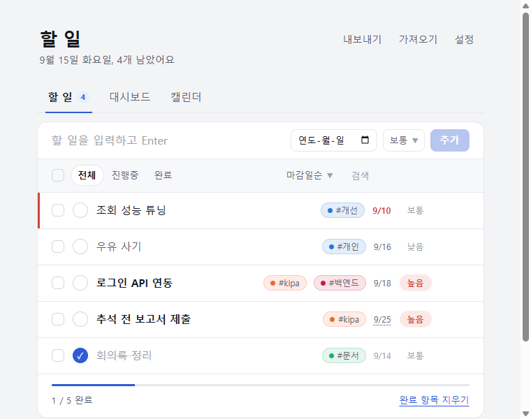 | 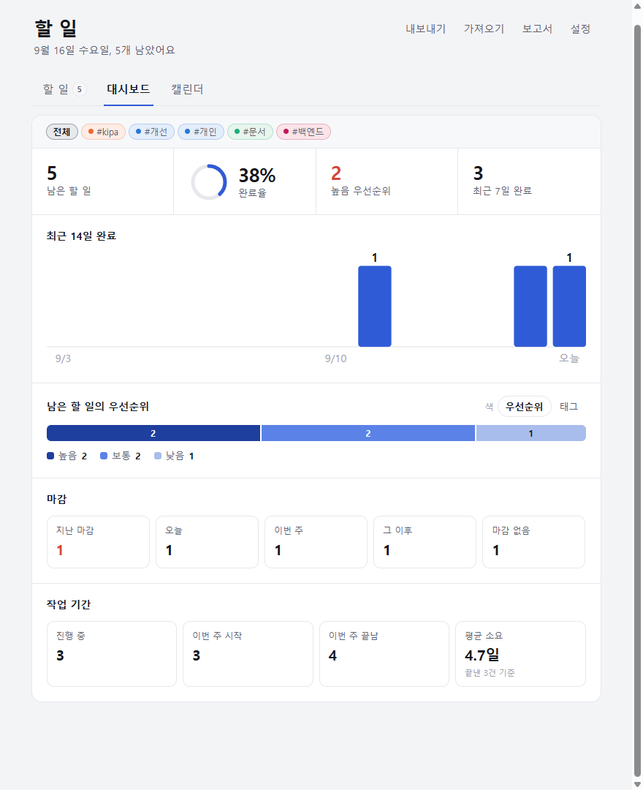 | 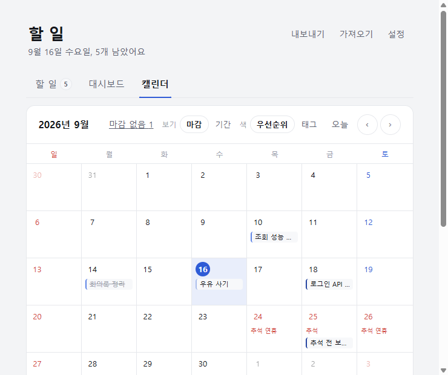 |

## 기능

**할 일**
- 추가 · 삭제. 제목·마감일 편집은 상세 화면에서
- **네모 체크박스는 "선택", 동그란 ✓ 버튼이 "완료"** — 체크가 곧 완료가 아니다
- **일괄 작업** — 하나라도 고르면 막대가 떠서 완료 처리 / 완료 취소 / 우선순위 일괄 변경 / 삭제(되돌리기 가능). 필터 줄의 체크박스로 보이는 항목 전체 선택(일부만 고르면 중간 표시)
- 삭제 직후 6초 안에 되돌리기
- 우선순위 높음 · 보통 · 낮음 — 추가할 때, 또는 항목의 드롭다운에서 골라서
- **정렬** — 우선순위순 / 마감일순 / 최근 추가순 / **직접순**. 어느 기준이든 완료한 것은 뒤로. 직접순에서는 줄 앞의 손잡이(⠿)를 끌어 옮기거나 `Alt+↑ ↓`
- **보관** — "완료 항목 지우기" 대신 **보관**: 끝낸 일을 목록에서 치우되 지우지 않습니다(대시보드 통계엔 남음). 보관 직후 토스트로 되돌릴 수 있고, "보관" 보기에서 하나씩 복원 / 모두 복원 / 보관함 비우기(되돌리기 가능)
- 마감일 — 지나면 줄 왼쪽에 붉은 선과 빨간 날짜, 공휴일이면 점선 밑줄(이름은 마우스를 올리면). 제목 끝에 `@내일` `@금` `@9/25` `@2026-10-02`처럼 적으면 마감일로 분리(`@오늘·모레·다음주`, 요일도 됨)
- **처음 열면** 쓰는 법 세 줄과 "예시 세 개 넣어 보기". 검색·조건에 걸리는 게 없을 때는 지우는 버튼이 바로 옆에
- **단축키** — `n` 새 할 일, `/` 검색, `1 2 3` 탭, 목록에서 `j k`(↓↑) 이동 · `Enter` 상세 · `x` 완료 · `Delete` 삭제, `?` 설정. 목록은 설정 → 단축키에
- 전체 / 진행중 / 완료 보기, 검색(제목과 노트 본문), 전체 완료 토글, 완료 진행률, 할 일 탭에 남은 개수 배지
- **태그** — 제목 끝에 `#kipa #개인`처럼 붙이면 태그로 분리. 상세에서 편집, 목록의 태그 칩을 누르면 그 태그만, 대시보드도 태그별로. 태그마다 **색**이 붙습니다 — 기본은 이름 해시로 네 가지 중 자동 배정(색각 이상에서도 서로 구분되도록 dataviz 검증기로 고른 값)이고, 설정에서 **색상 선택기로 원하는 색을 직접** 고를 수 있습니다. 글자는 늘 잉크색이라 어떤 색을 골라도 읽힙니다
- **하위 체크리스트** — 상세에서 항목을 추가·체크·수정·삭제. 목록에 `☑ 2/3` 진행 표시
- **실제 작업 기간** — 상세에서 시작일 ~ 종료일을 넣습니다. 마감일(언제까지)과 다른 값이라 따로 두고, 종료일을 비워 두면 "진행 중". 목록에는 `9/7~9/18` 칩으로, 캘린더에는 막대로 보입니다. 종료일이 지났는데 아직 안 끝낸 상태면 **"종료일이 지났어요 — 완료 처리"** 버튼이 떠서 그 날짜에 끝낸 것으로 찍습니다
- **상세 화면** — 제목을 누르면 열림. 제목 아래 **작업 화면 경로** 칸(보고서에 붙여 넣기 좋게 복사 버튼 포함), 우선순위·마감일·**기간**·태그 편집, 하위 항목, 그리고 **백엔드 / 프론트엔드 / 메모**로 나뉜 노트 목록. 코드·경로·링크를 붙여 넣으면 줄바꿈과 들여쓰기가 그대로 보존되고(고정폭), 노트마다 복사·수정·삭제. Ctrl+Enter로 추가, Esc로 닫기
- **노트 자동 링크** — `https://…`는 항상 링크, `r5074` 같은 커밋 번호는 설정(헤더 "설정")에 링크 형식(`https://svn.example.com/rev/{n}`)을 넣으면 링크

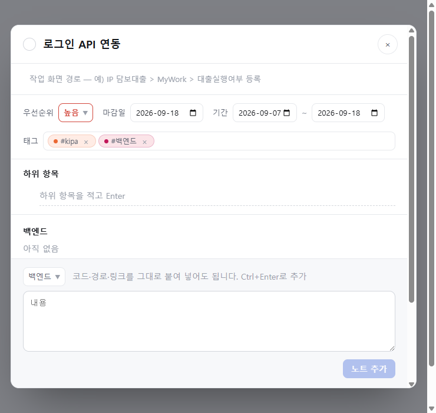

**대시보드**
- 숫자·차트 막대·마감 칸을 누르면 그 조건으로 걸러진 할 일 목록으로 이동 (`#todos?filter=active&due=overdue` 같은 해시라 북마크·뒤로가기 가능). 목록 위에 조건 칩과 "조건 지우기"
- 남은 할 일 · 완료율 · 높음 우선순위 · 최근 7일 완료
- 최근 14일 날짜별 완료 막대 차트
- 남은 할 일 분포 — **우선순위 / 태그** 중 골라서 (캘린더와 같은 설정을 씁니다)

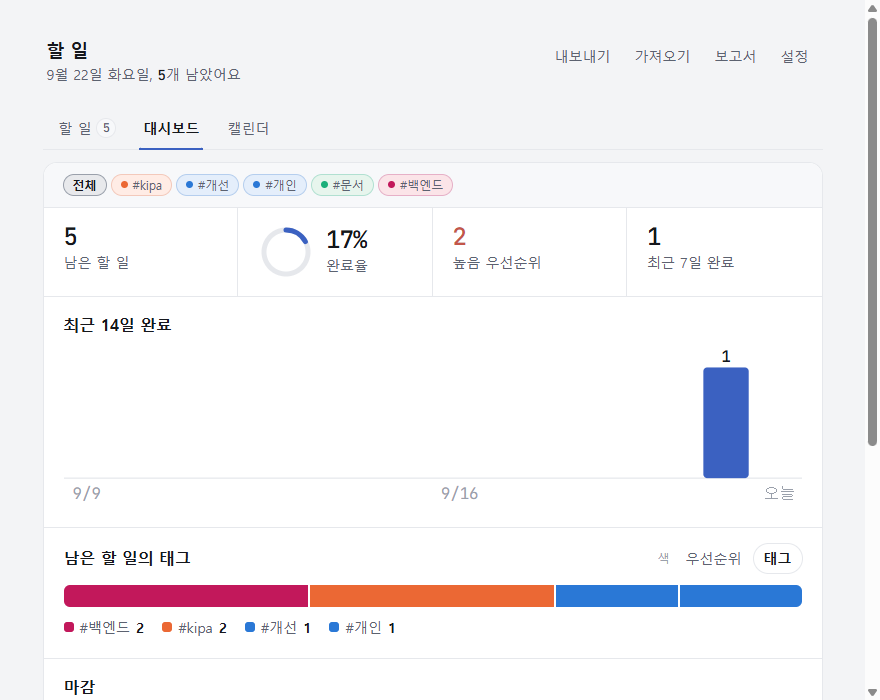
- 마감 현황 (지남 · 오늘 · 이번 주 · 그 이후 · 없음)
- **작업 기간** — 진행 중(오늘 목록으로 연결) · 이번 주 시작 · 이번 주 끝남 · 끝낸 일의 평균 소요일

**캘린더**
- **마감 / 기간 두 가지 보기** — 머리글의 "보기" 토글로 바꿉니다
  - 마감: 마감일 하루에 칩
  - 기간: 실제 시작일~종료일을 가로지르는 막대. 주를 넘으면 다음 줄로 이어지고(`⟵`), 겹치는 일정은 층이 갈립니다. 종료일이 없으면 오늘(완료했으면 완료한 날)까지 그리고 끝을 흐리게 해서 진행 중임을 보입니다. 막대를 누르면 상세

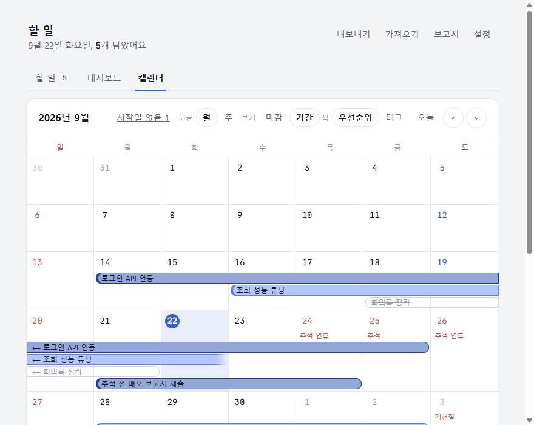
- **월 / 주 눈금** — "눈금" 토글. 주 눈금은 고른 날이 든 한 주만 크게 보여서 막대와 칩이 넉넉합니다. ‹ ›가 한 주씩 움직입니다

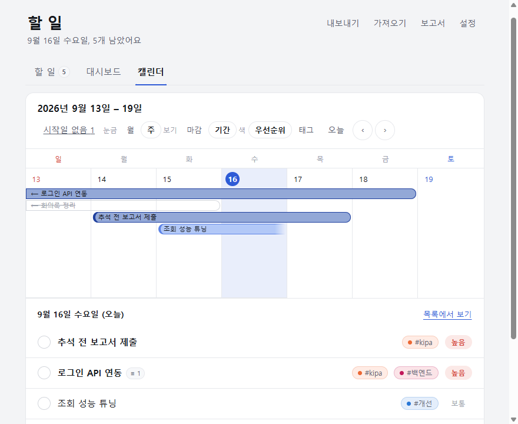
- 월 단위로 마감일별 할 일 표시, 날짜를 누르면 그 날 목록과 바로 추가 (목록에 태그·노트 개수도 함께)
- 선택한 날의 "목록에서 보기"(기간 보기면 그날 진행 중이던 항목), 헤더의 "마감 없음 N" · "시작일 없음 N" → 할 일 목록으로
- 칩 색을 **우선순위 / 태그** 중 선택
- **한국 공휴일 표시** — 날짜가 빨갛게, 칸에 이름이 뜹니다(설날·추석 연휴, 부처님오신날, 대체공휴일 포함)
- 오늘로 이동, 이전/다음 달

**저장과 이동**
- 할 일과 테마는 브라우저 `localStorage`에 자동 저장. 읽을 때 검증하고, 다른 탭에서 바꾼 내용도 바로 반영
- JSON 내보내기 / 가져오기 — 백업하거나 다른 기기로 옮길 때. 가져오기는 이미 있는 항목은 두고 새 것만 합침
- **기간 보고서** — 머리글 "보고서"(단축키 `r`). 이번 주 / 지난 주 / 이번 달 / 지난 달 / 직접 기간의 **끝낸 일 · 진행 중 · 마감 예정**을 Markdown으로 만들어 복사하거나 `.md`로 저장합니다. 경로, 하위 항목, 노트(커밋 번호·붙여 넣은 코드)까지 따라갑니다

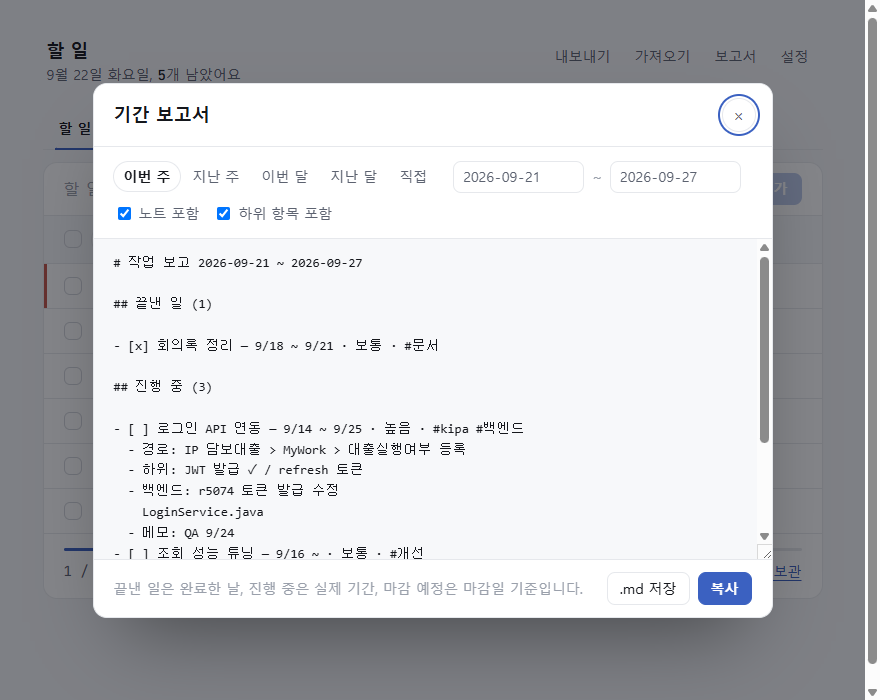
- 라이트 / 다크 / 시스템 테마 — 설정에서 선택
- 스킨 열한 가지 — 설정의 미리보기 카드에서 선택. 스킨마다 서체·재질·모양이 다릅니다

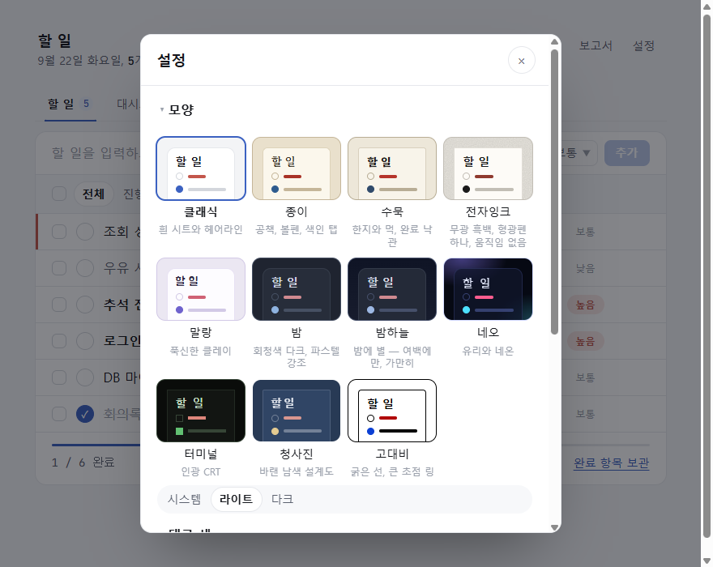

| 스킨 | 무엇이 다른가 |
|---|---|
| 클래식 | 흰 시트, 헤어라인 |
| 종이 | 공책 — 종이 결, 파란 괘선과 붉은 여백선, 색인 탭, 세리프 제목(Gowun Batang), 끝낸 일은 붉은 펜 |
| 수묵 | 한지와 먹 — 쪽빛 강조, 붓으로 그은 탭 밑줄, 족자 틀, 끝낸 일에 주홍 낙관 完 (Hahmlet) |
| 전자잉크 | 전자책 단말 — 무광 종이 결, 강조는 색이 아니라 먹, 고른 것은 형광펜을 그은 자리, 우선순위는 먹 농도. **움직임이 없습니다**(전환·애니메이션 모두 꺼짐) |
| 말랑 | 클레이 — 라벤더 바탕, 줄마다 방석, 누르면 내려앉는 버튼, 알약 탭 (Jua + Gowun Dodum) |
| 밤 | 개발자들이 제일 오래 쓰는 종류의 다크 — 남색 기운 회청색 바탕, 채도 뺀 파스텔 강조, 글로우 없음 (Nord·Catppuccin 계열) |
| 밤하늘 | 밤에 별을 얹은 것 — 별은 시트 밖 여백에만, 움직이지 않음. 위가 깊고 아래가 옅은 하늘 |
| 네오 | 우주 배경, 유리 패널, 네온, 각진 제목 서체(Orbit) |
| 터미널 | 초록 인광, 한글 고정폭(Nanum Gothic Coding), 주사선, 깜빡이는 커서, [전체] 필터 |
| 청사진 | 설계도 — 바랜 남색에 모눈, 흰 선 상자, 제도 연필의 호박색 강조, 점선 탭 밑줄, 표제란 이중선 (IBM Plex Sans KR) |
| 고대비 | 순흑백, 굵은 선, 큰 포커스 링 |

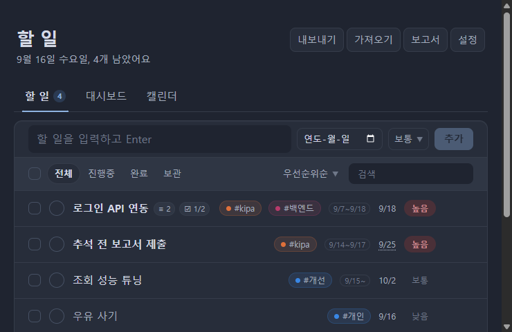
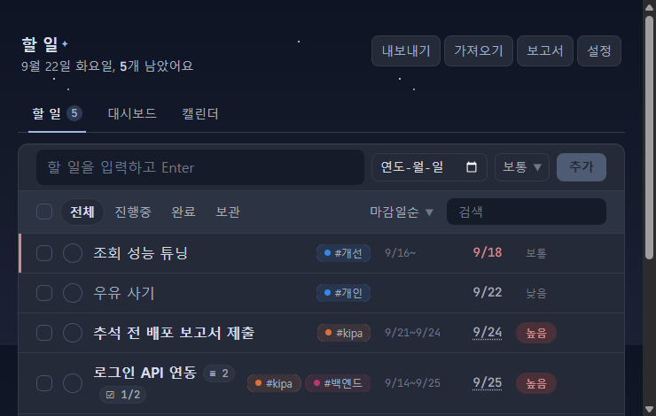
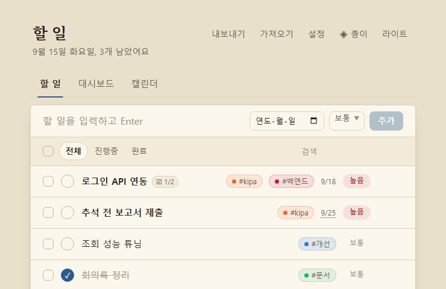
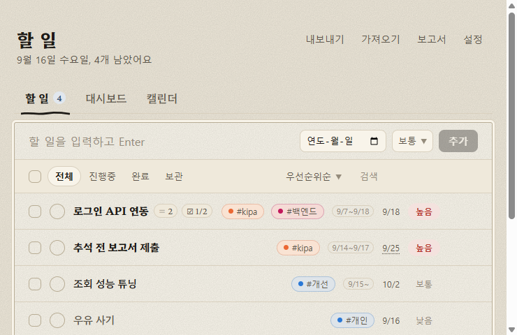
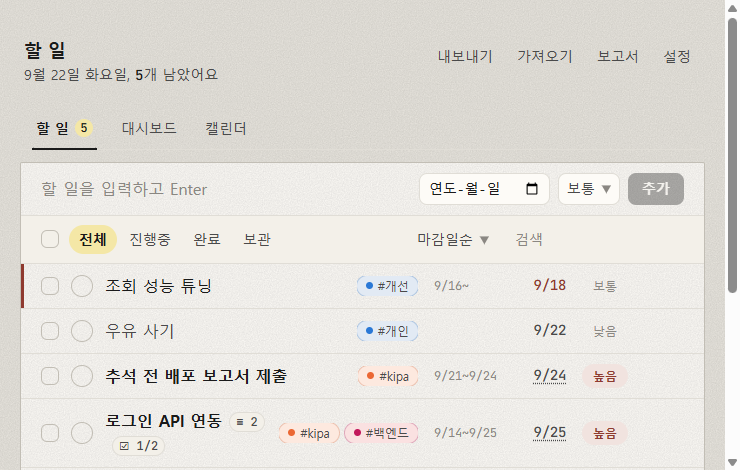
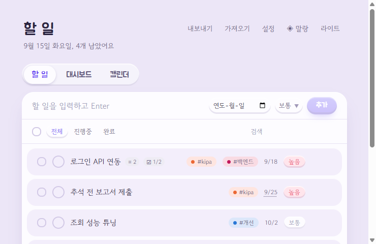
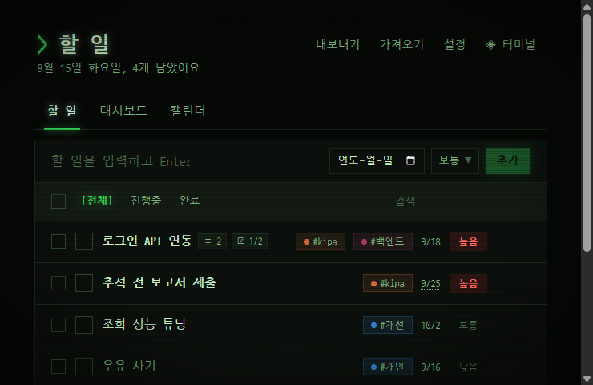
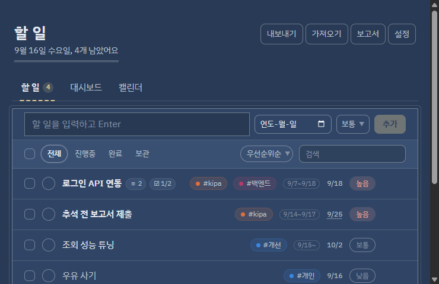

밤·밤하늘·네오·터미널·청사진은 어두운 톤 전용이라 그 상태에서는 테마 선택이 숨겨집니다. 나머지는 라이트/다크 모두 됩니다.
스킨을 바꾸면 화면이 겹쳐지며 바뀝니다(View Transition, `prefers-reduced-motion`이면 생략).
서체는 Google Fonts에서 받고, 못 받으면 각 스킨의 대체 서체로 그려집니다.
터미널·청사진·말랑의 색은 OKLCH 채도를 절반쯤으로 낮춘 값입니다 — 순도 높은 색은 오래 보면 피로해서요(네오는 원래의 네온 그대로). 태그 색만은 서로 구분돼야 해서 검증기를 통과한 값을 그대로 둡니다.
- 키보드만으로 조작 가능, 스크린리더 레이블, `prefers-reduced-motion` 존중
- 좁은 화면(390px)에서도 접힙니다 — 머리글 버튼은 다음 줄로, 할 일 줄은 제목과 메타 정보로 나뉩니다

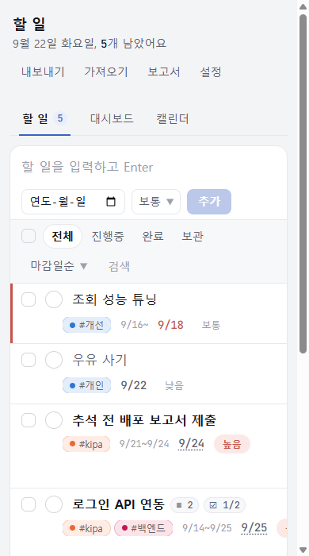

차트는 라이브러리 없이 SVG로 그립니다. 의존성은 `react`, `react-dom` 둘뿐입니다.

드롭다운 목록 칸도 앱 색과 둥근 모서리에 맞춰 직접 그립니다 — 표준 기능(customizable select, `appearance: base-select`)이라 `<select>`의 키보드 동작과 접근성은 그대로입니다. 이 기능이 없는 브라우저(현재 Firefox·Safari)에서는 브라우저 기본 목록이 나옵니다.

## 실행

Node 20 이상이 필요합니다. 프로젝트에 `.node-version`이 있어서 [fnm](https://github.com/Schniz/fnm)이나 nvm이 자동으로 버전을 맞춥니다.

```sh
npm install     # .npmrc가 legacy-peer-deps를 켜 둡니다 (npm 10 + vitest peer 버그 우회)
npm run dev     # http://localhost:5173
npm run build   # dist/
npm test        # vitest (watch)
npm run test:run
npm run lint    # oxlint
```

## 배포

`main`에 푸시하면 [deploy.yml](.github/workflows/deploy.yml)이 테스트 → 빌드 → GitHub Pages 배포를 합니다.
공개 주소: https://polos0117.github.io/eduReact/
처음 한 번은 저장소 **Settings → Pages → Build and deployment → Source**를 "GitHub Actions"로 바꿔야 합니다 (워크플로 토큰은 Pages를 만들 권한이 없음).
빌드 시 `BASE_PATH=/eduReact/`를 주므로 로컬 개발 주소는 그대로 `/`입니다.

## 디자인

작업일지에 가깝게 잡았습니다 — 체크리스트가 아니라 **열이 있는 기록부**.

- **눈금 하나로 통일한 글자 크기** — 12 · 14 · 16 · 18 · 24px 다섯 단계(달력 칸 안 미세 글자만 11px 예외). 예전엔 9~26px 이 열한 가지 섞여 있어 크기가 위계를 못 나타냈습니다
- **값은 값처럼** — 날짜·개수·기간·커밋 번호는 JetBrains Mono 로 찍습니다. 글(한글)과 서체부터 달라서 "읽는 말"과 "세는 값"이 눈에 바로 갈립니다
- **날짜가 세로로 맞습니다** — 목록의 기간·마감·우선순위는 고정 폭 칸에 앉습니다. 값이 없는 항목은 그 칸만 비고 나머지가 밀리지 않습니다. 좁은 화면에서는 칸이 안 들어가므로 줄바꿈으로 풉니다
- **상자 대신 구분선** — 대시보드의 통계·마감·작업 기간은 같은 "구분선으로 나눈 띠" 하나로 통일했습니다. 똑같은 둥근 카드가 아홉 개 늘어서던 자리입니다
- 줄 높이 52 → 44px. 보이는 크기는 그대로 두고 체크박스·완료 버튼의 잡히는 넓이만 넓혔습니다

## 구조

```
src/
  main.jsx                  진입점
  App.jsx                   셸 — 상태(useReducer + localStorage), 헤더, 탭(URL 해시), 내보내기/가져오기, 토스트
  index.css                 클래식 색 토큰 — light-dark() 로 라이트/다크를 한 줄에 + 글자·여백 눈금, 리셋, 포커스
  App.css                   시트·목록·대시보드·캘린더 스타일 (클래식)
  skin-neo.css              네오 스킨 — 배경·유리·글로우까지 바꿔서 분량이 커 따로 둠
  skins.css                 종이·수묵·전자잉크·말랑·밤·밤하늘·터미널·청사진·고대비 — 토큰 + 스킨마다의 서체·재질·모양
  hooks/
    usePersistedReducer.js  useReducer + localStorage (읽을 때 sanitize, 다른 탭 변경은 storage 이벤트로 반영)
    useNow.js               1분마다 갱신되는 현재 시각 — 자정 넘겨도 "오늘"이 맞게
    useTheme.js             useRootAttr — <html data-*> 속성을 localStorage와 묶어 순환 (useTheme, useSkin)
    useLocalState.js        작은 설정값용 useState + localStorage
    useTagColors.js         고른 태그 색을 트리 전체에 전달하는 context
  reducers/
    todoReducer.js          ADD · TOGGLE · TOGGLE_ALL · REMOVE · RESTORE · CLEAR_COMPLETED · EDIT · SET_PRIORITY · SET_DUE · SET_TAGS
                            · ADD/EDIT/REMOVE_NOTE · ADD/TOGGLE/EDIT/REMOVE_SUBTASK · IMPORT
                            · SET_PATH · 일괄: SET_COMPLETED_MANY · SET_PRIORITY_MANY · REMOVE_MANY · RESTORE_MANY
                            + 우선순위 정렬, 가져온 JSON 정규화(normalizeTodo), parseTags, subtaskProgress
    todoReducer.test.js
  lib/
    stats.js                날짜 키, 날짜별 완료 수, 우선순위 집계, 마감 분류, 달력 칸 생성
    report.js               기간 보고서 — 끝낸 일·진행 중·마감 예정을 Markdown 으로 (테스트 있음)
    stats.test.js
    holidays.js             한국 공휴일 — 양력 고정일과 대체공휴일은 계산, 음력 기준일만 표
    holidays.test.js
    linkify.js              노트의 URL·r번호를 링크 조각으로
    linkify.test.js
    tags.js                 태그 색 — 이름 해시 자동 배정과 직접 고른 색(hex), 태그 링크 주소
    tags.test.js
  components/
    Todo/
      TodoPage.jsx          "할 일" 탭 — 필터·검색 상태, 액션 dispatch
      TodoForm.jsx          입력 + 마감일 + 우선순위
      TodoFilter.jsx        전체 완료 · 보기 탭 · 검색
      TodoList.jsx / TodoItem.jsx
      TodoFooter.jsx        진행률, 완료 항목 지우기
    TodoDetail.jsx          상세 <dialog> — 제목/우선순위/마감일/태그, 하위 항목, 분류별 노트 목록과 추가 폼
    Settings.jsx            설정 <dialog> — 스킨 미리보기 카드·테마, 태그 색 고르기, 커밋 번호 링크 형식
    Report.jsx              기간 보고서 <dialog> — 프리셋/직접 기간, 노트·하위 항목 포함 여부, 복사·.md 저장
    ColorByToggle.jsx       대시보드·캘린더 공용 색 기준 전환
    Dashboard.jsx           통계 타일, SVG 막대 차트, 우선순위 누적 막대, 마감 현황
    Calendar.jsx            월 달력, 선택한 날 목록과 추가
drills/                     학습용 순수 JS 연습 문제 (node drills/01-destructuring.js)
```

상태는 `App` 한 곳에서 `useReducer`로 관리하고, 각 탭은 `todos`와 `dispatch`를 props로 받습니다. 리듀서와 통계 함수는 순수 함수라 테스트가 쉽습니다.

### 데이터 모양

```json
{ "id": 1757900000000, "text": "로그인 API 연동", "completed": false,
  "priority": "high", "dueDate": "2026-09-18",
  "path": "IP 담보대출 > MyWork > 대출실행여부 등록",
  "createdAt": 1757900000000, "completedAt": 1757950000000,
  "tags": ["kipa"],
  "subtasks": [{ "id": 1757900000002, "text": "JWT 발급", "done": true }],
  "notes": [
    { "id": 1757900000001, "category": "backend", "text": "POST /api/auth/login", "createdAt": 1757900000001 }
  ] }
```

`priority`·`dueDate`·`completedAt`·`path`·`tags`·`subtasks`·`notes`는 없을 수 있습니다(예전 데이터). 없으면 보통 / 마감 없음 / 시각 모름 / 없음으로 봅니다. `notes[].category`는 `backend` · `frontend` · `memo`.

### 공휴일

양력 고정일(신정·삼일절·어린이날·현충일·제헌절·광복절·개천절·한글날·성탄절)과 **대체공휴일은 규칙으로 계산**합니다.
연도별로 적어 두면 틀리기 쉬워서, 바뀌지 않는 것만 표로 뒀습니다 — 음력 기준일(설날·추석·부처님오신날)이며 **2025~2030년** 범위입니다.
그 밖의 해는 양력 고정일만 나옵니다. 임시공휴일·선거일처럼 그때그때 정해지는 날은 담지 않습니다.

대체공휴일 규칙: 설날·추석 연휴는 **일요일**과 겹칠 때만, 나머지 대상 공휴일은 토·일이거나 다른 공휴일과 겹칠 때 다음 첫 평일로.
신정과 현충일은 국경일이 아니라 대체공휴일 대상이 아닙니다. 제헌절은 2026년에 공휴일로 재지정되었습니다.
`holidays.test.js`가 2025·2026·2028년 전체를 공표된 날짜와 대조합니다.

## 배운 것

`drills/`의 01–06은 프로젝트를 만들며 막혔던 JS 문법을 따로 떼어 연습한 파일입니다: 구조 분해, 배열과 객체, 스프레드, 값으로서의 함수, 삼항과 체이닝, 비동기.
